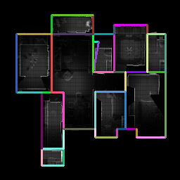
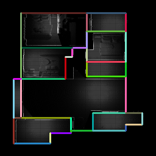
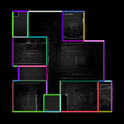

# Structured3D Preprocessing

To generate planar graph (walls):

1. Download MonteFloor data from here [link](https://drive.google.com/file/d/1XpKm3vjvw4lOw32pX81w0U0YL_PBuzez/view?usp=sharing)
2. Run `python generate_planar_graph.py`
3. Check output files planar_graph_walls.png

## Examples

